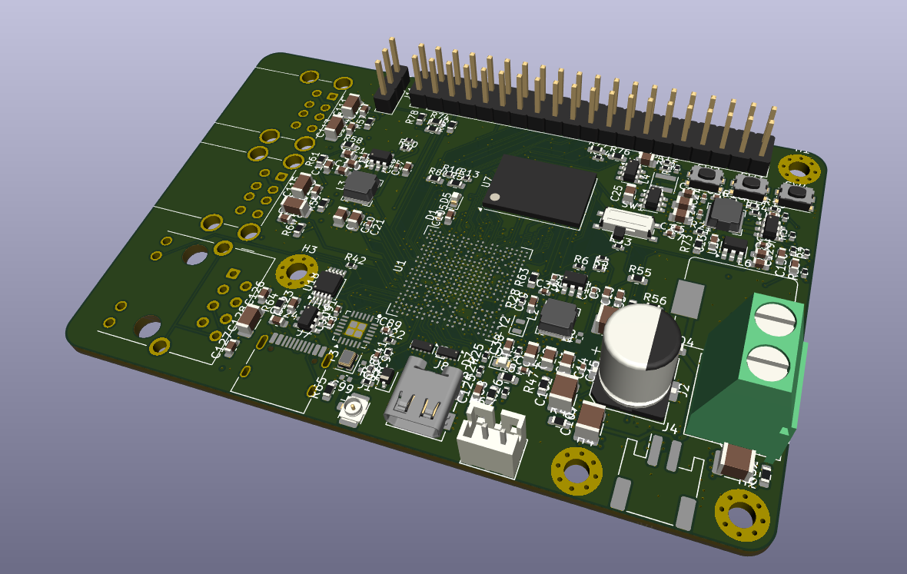

# Claude KiCad PCB Designer Skill

Two [Claude Code](https://claude.com/claude-code) skills that take a board from **idea → ERC-clean KiCad schematic → routed, DRC-clean PCB → manufacturer-ready release package**, with every step scripted, reproducible and verified with `kicad-cli`.



*A KiCad 3D-viewer render of the kind of board this workflow targets: a dense, multi-layer design with a BGA SoC, a 40-pin header, USB-C and a switching power stage.*

| Skill | What it does |
|---|---|
| [`kicad-schematic-generator`](skills/kicad-schematic-generator/SKILL.md) | Generates complete, hierarchical KiCad 9/10 schematic projects from Python and proves them correct with ERC, netlist checks and design-specific assertions. |
| [`kicad-pcb-autorouter-workflow`](skills/kicad-pcb-autorouter-workflow/SKILL.md) | A staged process for placing and routing a custom PCB with a negotiated-congestion (PathFinder-style) autorouter, repairing planes and DRC, tuning length/skew, reviewing in an interactive HTML viewer and shipping fab files. |

They work together (schematic first, then PCB) but each can be used on its own.

> **Keywords:** KiCad 9 / KiCad 10 · PCB design automation · schematic generator · PCB autorouter · `kicad-cli` ERC/DRC · Gerber X2 · BGA fan-out · DDR3 length tuning · differential pairs · Claude Code skills · agent skills

---


## What is this project?

**Claude Code KiCad PCB Designer Skill** is an open-source **AI-assisted PCB design workflow for KiCad**. It gives [Claude Code](https://claude.com/claude-code) reusable skills for **KiCad schematic generation, PCB placement, PCB autorouting, ERC/DRC verification, signal-length tuning, design review, and manufacturing release**.

If you are looking for a **KiCad AI agent**, **Claude Code PCB design skill**, **KiCad automation**, **AI PCB designer**, **KiCad schematic generator**, or **KiCad autorouter workflow**, this repository is designed for that use case.

### Search terms and aliases

- Claude Code KiCad skill
- Claude Code PCB design
- Claude Code PCB designer
- AI PCB design
- AI PCB layout
- AI EDA agent
- KiCad AI automation
- KiCad automation with Python
- KiCad schematic generator
- KiCad PCB autorouter
- KiCad PCB routing automation
- KiCad ERC DRC automation
- KiCad 9 automation
- KiCad 10 automation
- kicad-cli ERC DRC
- pcbnew Python automation
- BGA PCB routing
- DDR3 PCB length matching
- differential pair routing
- Gerber manufacturing release
- Claude Code hardware design
- Claude skills for electronics

### Why this repository is different

This is not only a prompt collection or a wrapper around an external autorouter. The skills define a **verified, staged engineering workflow** from schematic to fabrication:

**requirements → schematic → ERC/netcheck → placement → BGA fan-out → planes/decoupling → autorouting → DRC repair → length/skew tuning → independent design review → ECO → Gerber/BOM/CPL release**

The workflow is intended for real boards, including dense multi-layer designs, BGA devices, DDR3 memory, differential pairs, power planes, and manufacturing outputs.

## Table of contents

- [Capabilities at a glance](#capabilities-at-a-glance)
- [Skill 1: Schematic generator in detail](#skill-1-schematic-generator-in-detail)
- [Skill 2: PCB + autorouter workflow in detail](#skill-2-pcb--autorouter-workflow-in-detail)
- [End-to-end pipeline](#end-to-end-pipeline)
- [Installation](#installation)
- [Usage](#usage)
- [Requirements](#requirements)
- [Repository layout](#repository-layout)
- [Quality gates and honesty rules](#quality-gates-and-honesty-rules)
- [Limitations](#limitations)
- [Documentation](#documentation)
- [Contributing](#contributing)
- [License](#license)

---

## Capabilities at a glance

**Schematic design**
- Generates real `.kicad_sch` / `.kicad_pro` files from a Python script, so the design is reproducible, diffable and easy to change when a part is swapped.
- Hierarchical sheets, automatic layout, global/local labels, no-connect flags and paper-size selection (A4 to A0), all handled by the `kigen` library.
- Custom multi-unit symbols (large SoCs, DDR, FPGAs) built from pin tables, plus automatic embedding and flattening of stock KiCad library symbols.
- Custom footprints such as fine-pitch BGAs when the stock library lacks them.
- Completeness enforced by construction: every pin must be given a net or an explicit `NC`, otherwise generation fails.

**Verification**
- `kicad-cli sch erc` to 0 errors / 0 warnings.
- `netcheck.py`: duplicate references, single-node nets, missing footprints, and symbol pins that do not exist on the assigned footprint.
- Design-specific assertions (`verify.py`): SoC pin-to-net mapping against a reference design, connector pinouts pin by pin, memory byte lanes and address fan-out, power balls on the correct rails, and regulator output voltages **computed from the real divider values in the netlist**.
- Visual review of every exported PDF page.

**PCB placement and routing**
- Multi-stage placement with courtyard-overlap checking, escape-corridor keepouts reserved before small parts are placed, and signal-order checks along each chain.
- BGA fan-out (dog-bone vias), split power planes with wide necks, decoupling-capacitor via strategy, via-in-pad where rear rows cannot escape.
- A negotiated-congestion autorouter workflow: one routing object per net or differential pair, a legality field built from all existing copper, and rip-up with present x history pressure until conflicts reach 0 or plateau.
- Per-board configuration of layers, grid, net-class clearances, widths, layer costs, pair handling, via cost, keepouts and plane nets.
- Small exact tools for single connections in dense areas: grid A* with exact clearance, via nudging, fan-out restoration, nearest-legal-spot part placement and plane-via insertion.
- Edge-connector checks: the mating direction (for example a card slot facing inward) is verified, not just the position.

**Signal integrity and tuning**
- Intra-pair skew checks for DQS/CK and other pairs, not just lane matching.
- Accordion meander tuning of uncoupled pairs (HDMI, USB, Ethernet) against an exact clearance field.
- 2-D field-solver Zdiff for loosely coupled pairs, so DRC rules are relaxed *with a documented reason* instead of shipping dozens of unexplained warnings.
- DDR mismatch reported in mm and ps (about 6-7 ps/mm) with a safe starting DRAM clock.

**Design review and ECOs**
- A full "0 to 100" design review: four independent read-only review passes (power, SoC/DDR, peripherals, PCB physical/fab), after which **every finding is verified against the reference schematic before anything is changed** and classified as blocker / major / minor / false alarm.
- A checklist of defects that survive clean DRC/ERC/parity (unconnected footprint pads, SoC special balls wired differently from the vendor reference, backwards pull-up diodes, rail set points above a pin's absolute maximum, buck hot-loop problems, and more).
- ECO workflow for schematic changes on an already-routed board: references never shift, old-vs-new netlist diff, footprint swaps in place, only the affected copper is ripped and rerouted.

**Review and delivery**
- Interactive, self-contained HTML viewer: canvas renderer, per-layer toggles, via toggle, net/part search and highlight, stage picker, placement table, stackup/impedance tab, per-stage notes.
- Release checklist: merged `.kicad_pro`/`.kicad_dru`, `kicad-cli pcb drc --schematic-parity` to 0, real stackup, Gerber X2, Excellon, positions, assembler CPL, grouped BOM, schematic PDF, ERC/DRC reports and renders, all packaged into `kicad/`, `fab/`, `docs/`, `tools/`.
- Assembly readiness: BOM mapped to MPN and LCSC part numbers with stock/package checks, a JLCPCB-format BOM and CPL, three fiducials per side, silkscreen reference re-placement, and an optional second-opinion automated review with a written waiver list.
- A release README whose top section is "what changed in this version" (area / problem / fix) and "checked and found correct".
- Fabrication notes: impedance control, ENIG for fine-pitch BGA, epoxy-filled and capped vias for via-in-pad, minimum track/space/via, double-sided assembly.

---

## Skill 1: Schematic generator in detail

**Skill file:** [`skills/kicad-schematic-generator/SKILL.md`](skills/kicad-schematic-generator/SKILL.md)
**Helper code:** [`skills/kicad-schematic-generator/gen/`](skills/kicad-schematic-generator/gen) (`kigen.py`, `netcheck.py`)

Use it when you want a real KiCad schematic (not just a description) for an SBC, MCU board, power supply, or anything else.

### Principles it enforces

1. **Never invent pinouts.** Pin numbers come from a datasheet, a vendor/reference schematic or the stock KiCad library. For BGA SoCs and DDR, the datasheet ball table is parsed (`pdftotext -layout`) and cross-checked against a second independent source. The source of each custom symbol is recorded in code.
2. **Prefer stock KiCad symbols and footprints.** Their pin numbers already match their footprints; custom symbols are drawn only when necessary.
3. **Start from reference designs.** Open schematics (for example Orange Pi / Banana Pi / NanoPi PDFs hosted on linux-sunxi.org) are rendered with `pdftoppm` and read visually; proven support circuitry (strapping, references, bias resistors, power tree) is copied.
4. **Local availability matters.** If a part is unobtainable where you buy parts, it is swapped for a pin-compatible or functionally equivalent one and dividers/values are recomputed.
5. **Verify, don't trust.** Delivery requires ERC = 0, netcheck = 0 problems, passing design assertions and a visual PDF review.

### The `kigen` library

| Function / class | Purpose |
|---|---|
| `load_lib(lib, name)` | Copy and flatten a stock symbol (handles `extends`). Pins can be addressed by number or name. |
| `make_ic(lib_id, units=[...])` | Build a custom, possibly multi-unit, symbol from left/right/top/bottom pin lists. Electrical types: `power_in`, `power_out`, `input`, `output`, `bidirectional`, `passive`, `open_collector`, `no_connect`. |
| `Project` / `Sheet` | Hold the sheets, reference counters and the root sheet; `write()` emits all `.kicad_sch` files and a `.kicad_pro` with sensible ERC severities. |
| `Flow` | Automatic row-based placement: `section()`, `add()`, `newrow()`. |

Key behaviours: nets used on more than one sheet automatically become global labels; stacked hidden pins share a label; unknown or missing pins raise an error; strings are escaped; paper size is chosen from the content.

### Verification toolchain

```bash
cd gen && python3 build.py && cd ../kicad
kicad-cli sch erc -o erc.rpt --severity-all <name>.kicad_sch && tail -1 erc.rpt
kicad-cli sch export netlist -o ../<name>.net <name>.kicad_sch
python3 ../gen/netcheck.py ../<name>.net --local-fp mylib=mylib.pretty
python3 ../gen/verify.py
kicad-cli sch export pdf -o ../<name>_schematic.pdf <name>.kicad_sch
kicad-cli sch export bom --fields 'Reference,Value,Footprint,MPN,${QUANTITY}' \
  --labels 'Refs,Value,Footprint,MPN,Qty' --group-by 'Value,Footprint' --exclude-dnp \
  -o ../<name>_bom.csv <name>.kicad_sch
```

### Deliverables

A zipped project plus schematic PDF and BOM CSV, and a README listing the sheets, what was verified (and with which KiCad version), and an honest "before fabrication" list: missing footprints, compensation to confirm, crystal load capacitance, RF tuning, power budget, and the fact that the PCB is not yet done.

### Pitfalls the skill already knows about

Duplicate references across sheets that ERC misses, pin-name vs. pin-number collisions (DDR3 ball `A7` vs. address `A7`), `power_out` conflicts on multi-LX regulators, missing `PWR_FLAG`s, library pin renames between KiCad versions (KiCad 10: `SH` shield pins), pretty-printed KiCad 10 netlists, and untrustworthy third-party "PCB pipeline" skills that fake DRC reports. See the [pitfall list](docs/schematic-generator.md#pitfalls).

---

## Skill 2: PCB + autorouter workflow in detail

**Skill file:** [`skills/kicad-pcb-autorouter-workflow/SKILL.md`](skills/kicad-pcb-autorouter-workflow/SKILL.md)

A repeatable process for taking a KiCad schematic to a routed, DRC-clean, manufacturer-ready PCB. It was proven on a 6-layer Allwinner H3 + DDR3 single-board computer (85 x 56 mm, TFBGA-347 at 0.65 mm pitch, HDMI Type A, 275 parts, DRC 0 / ERC 0 / schematic parity 0), taken through ECO releases v2 to v5.1 including a full independent design review.

**Important:** this skill is a *methodology and checklist* that Claude executes by writing per-project Python scripts against KiCad's `pcbnew` API (for example `stage1.py`, `stage2.py`, `ncroute.py`, `cfg_<board>.py`, and helper tools such as `astar1.py`, `movevia.py`, `place_free.py`, `plane_via.py`). The skill describes what each helper does; the code is not included here. The router itself is generated and tuned for each board; it is not a standalone binary shipped in this repository.

### What each stage covers

| Stage | Content |
|---|---|
| Schematic first | ERC to 0, then netlist export. |
| Placement | Outline, holes, keepouts, per-block placement, courtyard checks; power/GND weighting, decap anchoring, escape corridors, chain-order and RF pad-order checks, buck-converter unit placement, edge-connector mating direction. |
| Fan-out, planes, decaps | BGA dog-bone vias, split plane zones with wide necks, via-in-pad (IPC-4761 type VII), locked fan-out copper. |
| Autorouting | Negotiated-congestion router, staged by net group (`NETRX`), fat-pair differential handling, only-routes-what-is-missing behaviour for local ECOs, `STAG` budgeting, separate `failed` vs. `dropped` accounting. |
| DRC loop | DRC on a refilled copy after each change; fix in order: shorts, clearance, unconnected, tracks_crossing, items_not_allowed, diff_pair_*, dangling. |
| Dense single connections | Exact A* router, via nudging, fan-out restoration and free-spot placement; connected-component analysis to tell a placement problem from a router problem. |
| Length and skew | Rubber-band old meanders, tune each DDR byte lane to its own DQS, match pairs first, Zdiff via field solver, DDR mismatch in mm and ps. |
| Design review | Four parallel read-only review passes, finding-by-finding verification against reference schematics, blocker/major/minor/false-alarm classification. |
| ECO | Generator-driven schematic changes, netlist diff, in-place footprint swaps, minimal rip-up and reroute. |
| Viewer | Self-contained interactive HTML viewer, published stage by stage. |
| Release | Merged project files, parity DRC, stackup, supplier-mapped BOM, fiducials, silk cleanup, Gerber X2, Excellon, CPL, renders, optional second-opinion review, README, zip. |

### Planes, pours and connectivity repair

Guidance for counting fill pieces per zone, DRU rules that let plane web flow between fan-out vias, a union-find cluster linker with grid Dijkstra to bridge stranded islands, vias for orphan plane pads, exact-match dangling-copper cleanup, outer GND pours with stitching, and widening a power feed without breaking another plane's connectivity.

### Tooling pitfalls it records

Copying `.kicad_pro` + `.kicad_dru` next to every intermediate board before `ZONE_FILLER`; one bad DRU rule silently dropping all custom rules; `GetConnectedItems` not being transitive; SWIG wrappers degrading after `board.Remove()`; unlocked vias disappearing on rip-up; SWIG proxies that must not be compared with `is`; footprint-owned rule areas that every custom tool must load; pad sizes that are pre-rotation; the roughly 2-minute shell limit that requires background jobs with `.done` markers; never `pkill -f` with a pattern that matches your own shell. See [docs/pcb-autorouter-workflow.md](docs/pcb-autorouter-workflow.md).

---

## End-to-end pipeline

```
 requirements
     │
     ▼
 kicad-schematic-generator          kicad-pcb-autorouter-workflow
 ┌──────────────────────────┐      ┌──────────────────────────────────────────┐
 │ pin data + references    │      │ placement → fan-out/planes → autoroute   │
 │ symbols.py / build.py    │ ───▶ │ → DRC loop → length/skew tuning          │
 │ ERC · netcheck · verify  │      │ → HTML viewer → release package          │
 │ PDF + BOM + netlist      │      │   (Gerber X2, Excellon, CPL, BOM, docs)  │
 └──────────────────────────┘      └──────────────────────────────────────────┘
```

---

## Installation

### Option A: install script

```bash
git clone https://github.com/Novin3dp/claude-KiCad-pcb-designer-skill.git
cd claude-KiCad-pcb-designer-skill
./scripts/install.sh              # personal: ~/.claude/skills
./scripts/install.sh --project    # or only for the current project: ./.claude/skills
```

### Option B: manual copy

```bash
cp -r skills/kicad-schematic-generator      ~/.claude/skills/
cp -r skills/kicad-pcb-autorouter-workflow  ~/.claude/skills/
```

### Option C: `.skill` archives

```bash
./scripts/package.sh     # creates dist/*.skill (zip archives) to upload where skills are supported
```

Restart Claude Code (or start a new session) and the skills appear in the available-skills list. More detail in [docs/installation.md](docs/installation.md).

---

## Usage

Just describe what you want; the skill descriptions let Claude pick the right one.

> "Design a schematic for an STM32-based 4-channel motor driver board with USB-C power. Make it ERC-clean and give me the BOM."

> "Take this KiCad schematic and route it as a 4-layer board with a 90-ohm USB pair and a ground plane. Show me progress per stage."

> "Build a hierarchical schematic for an Allwinner H3 SBC using the Orange Pi One schematic as the reference."

Try the dependency-free generator example:

```bash
python3 examples/minimal-board/build.py     # writes examples/minimal-board/kicad/
```

---

## Requirements

| Need | Notes |
|---|---|
| Claude Code | To load and run the skills. |
| KiCad 9 or 10 | Install the **same major version you use**; KiCad 7 has no `kicad-cli sch erc`. Output built on KiCad 10 libraries can contain tokens KiCad 9 cannot read. |
| Python 3 | Runs `kigen.py`, `netcheck.py` and your project scripts. `pcbnew` (bundled with KiCad) is needed for PCB work. |
| `poppler-utils` | `pdftotext` / `pdftoppm` for reading datasheets and reference schematics. |
| Optional | `scipy` / `numpy` for routing-grid analysis; a 2-D field solver for Zdiff. |

Ubuntu 24.04 setup commands are in [docs/installation.md](docs/installation.md#kicad-setup-ubuntu-2404).

---

## Repository layout

```
.
├── README.md
├── LICENSE
├── skills/
│   ├── kicad-schematic-generator/
│   │   ├── SKILL.md              skill instructions (embeds kigen.py and netcheck.py verbatim)
│   │   └── gen/
│   │       ├── kigen.py          schematic generator library
│   │       └── netcheck.py       netlist sanity checker
│   └── kicad-pcb-autorouter-workflow/
│       └── SKILL.md              PCB placement/routing/release workflow
├── docs/
│   ├── installation.md
│   ├── schematic-generator.md
│   ├── pcb-autorouter-workflow.md
│   └── images/
├── examples/
│   └── minimal-board/build.py    smallest possible kigen project
└── scripts/
    ├── install.sh
    └── package.sh
```

---

## Quality gates and honesty rules

These rules are part of the skills and are what make the output trustworthy:

- A schematic is delivered only with **ERC 0/0, netcheck 0, design assertions passing and PDF pages inspected**.
- A board is not "done" because DRC is clean: clean DRC with **missing nets or untuned pairs is not finished**.
- Every stage is reported as it completes, and `failed` (never routed) and `dropped` (removed for conflicts) are never blurred.
- Cosmetic leftovers (silk overlap, stale notes) are separated from real risks (DDR timing, no SI/PI simulation, no 3D models for an enclosure check).
- A pre-design is never presented as final.
- Review findings are verified by looking at the reference schematic before any change is made; automated reviewers both invent problems and find real ones.
- A board can be DRC/ERC/parity clean and still be wrong (a card slot facing inward, a SoC pin on the wrong rail), so a clean report is never treated as proof of correctness.
- Third-party "PCB pipeline" tools are read fully before their output is trusted. The optional second-opinion reviewer named in the PCB skill (`sabas0ba/kicad_skills`, Apache-2.0) is an external project; review it before vendoring it.

## Limitations

- The router and stage scripts are written per project by Claude; results depend on board density and your review.
- No SI/PI simulation is performed; Zdiff comes from a 2-D field solver and DDR timing is reported as mismatch only.
- Pinouts for new parts depend on the datasheet or reference design you can supply or Claude can fetch.
- The skills target KiCad 9/10; other versions are not supported.
- Always run a final check in KiCad and review the fab package before ordering boards.

## Documentation

- [Installation and environment setup](docs/installation.md)
- [GitHub description and topics](docs/repository-metadata.md)
- [Schematic generator guide](docs/schematic-generator.md)
- [PCB + autorouter workflow guide](docs/pcb-autorouter-workflow.md)

## Contributing

Issues and pull requests are welcome. When you add a pitfall or workflow step, keep it concrete (symptom, cause, fix), and keep `SKILL.md` and the extracted files in `skills/*/gen/` identical. Run `python3 -m py_compile skills/kicad-schematic-generator/gen/*.py` and `python3 examples/minimal-board/build.py` before submitting.

## License

[MIT](LICENSE)
